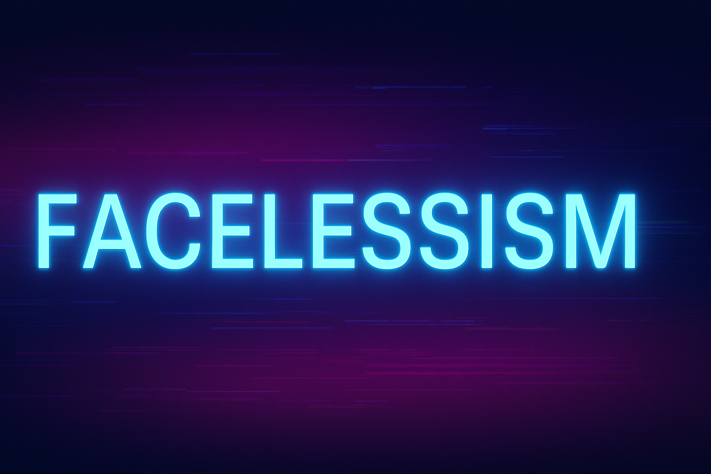

  

## Hi there 👋, I'm Facelessism

  

### About Me
Focused on improving technical ability and building a strong foundation.  
Currently working across frontend, backend, scripting and a bit automation.  
I appreciate clean design, efficient systems and quiet execution.

### Currently Learning
- Modern JavaScript development patterns
- Web Development
- Python scripting & Python for automation and backend tasks  
- Modern project architecture and workflow discipline

### Looking to Collaborate On
Projects with clear direction, purposeful design and long-term maintainability.

### Aesthetic (Banner / GIF coming soon...)

  Visuals loading...

### Projects
Currently organizing and building 'em. Projects will be listed here soon.

### NOTE
My code works! I don’t know how & why. Please don’t touch it!!!
