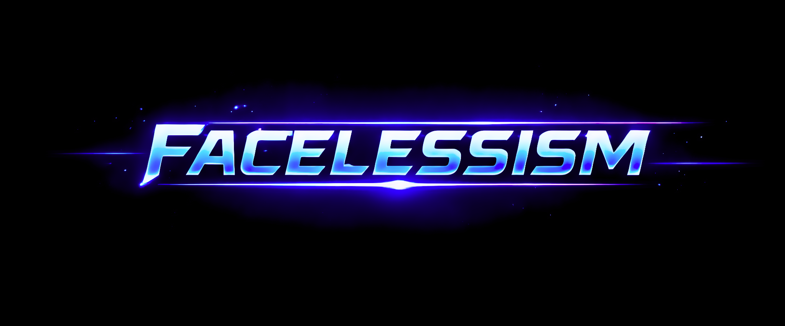

  <h1 style="color:#00F7FF;">Facelessism 👻</h1>

    

  

  <h3 style="color:#BB86FC;"> About Me</h3>
  

    Focused on improving technical ability and building a strong foundation.  
    Currently working across frontend, backend, scripting and a bit of automation.  
    I appreciate clean design, efficient systems and quiet execution.  
    Still learning, still building, still curious. 🍃
  

  
  <h3 style="color:#BB86FC;"> Currently Learning</h3>
  <ul style="text-align:left;">
    <li>Modern JavaScript development patterns</li>
    <li>Web Development</li>
    <li>Python scripting & Python for automation and backend tasks</li>
    <li>Modern project architecture and workflow discipline</li>
  </ul>

  <h3 style="color:#BB86FC;"> Looking to Collaborate On</h3>
  

      I look forward to collaborating, experimenting and building cool & high-end projects.

  

    Feel free to star my repos, open issues or just connect with me to stay updated on my latest works.

  Check out all my repositories here: 
  <a href="https://github.com/Facelessism?tab=repositories">My GitHub Repos</a>

  
  <h3 style="color:#BB86FC;"> Tech Stack</h3>
  

    
  

<h3 style="color:#BB86FC;">📊 GitHub Stats</h3>

  
  
  
  
  
  
  

<table><tr>
<td> </td>
<td></td>
</tr></table>

<h3 style="color:#BB86FC;">📈 Contribution activity graph</h3>

<h3 style="color:#BB86FC;">🎖️ Github Badges</h3>

  

  <h3 style="color:#BB86FC;"> Featured Projects</h3>
  

    Currently organizing and building 'em. Projects will be listed here soon.
  

  <h3 style="color:#BB86FC;">📝 Important Note</h3>
  

    If my code works, I'm just as amazed as you!!! Please don’t touch it!!!
  

  <h3 style="color:#BB86FC;">🌐 Socials</h3>
  

    
    
  

